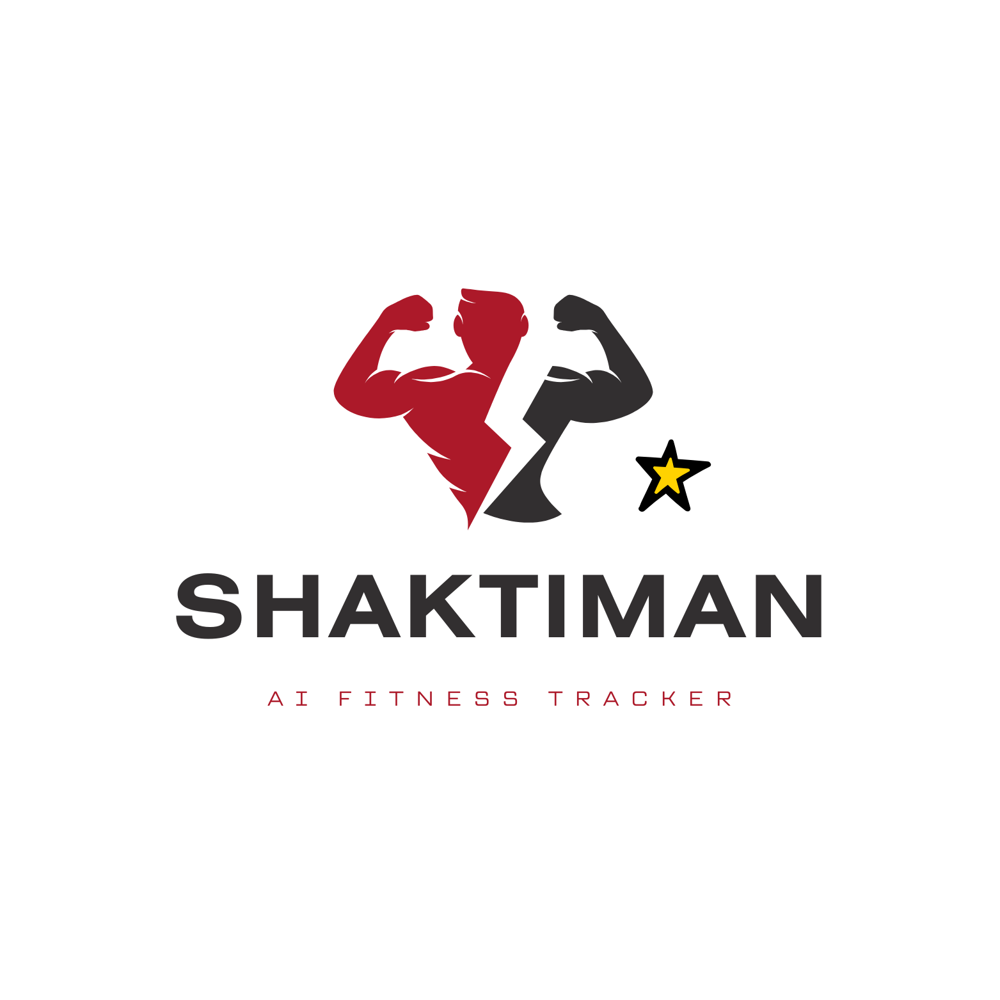

# SHAKTIMAN- AI Fitness Tracker
> An AI-powered fitness assistant that records body metrics, tracks fitness progress, and provides personalized diet and workout suggestions.
> Live demo [_here_](https://www.example.com). <!-- If you have the project hosted somewhere, include the link here. -->

## Table of Contents
* [General Info](#general-information)
* [Technologies Used](#technologies-used)
* [Features](#features)
* [Screenshots](#screenshots)
* [Setup](#setup)
* [Usage](#usage)
* [Project Status](#project-status)
* [Room for Improvement](#room-for-improvement)
* [Acknowledgements](#acknowledgements)
* [Contact](#contact)
<!-- * [License](#license) -->

## General Information
Team Members: Sapnil Basnet, Surendra Bikram Khatri, Bigyan Dhakal, Misan Parajuli, Sachin Pandey

What we’re creating: An AI-powered fitness tracker that records user data (weight, shape, sleep, overall fitness) and provides personalized diet and calorie recommendations to achieve fitness goals.

Audience: Fitness enthusiasts who want to track progress and receive AI-based diet and workout suggestions.

Why we’re doing this: As a team, we are passionate about health and fitness. We want to build a tool that not only tracks metrics but also motivates people to live healthier lifestyles by combining AI with accessible fitness tracking. 

## Technologies Used
Python
 – backend logic and AI models

React
 – frontend interface

Firebase
 or alternative – authentication & database (TBD)

Flask 

Github, Bitbucket

MySQL

## Features
1. User Profiles

What it does: Allows users to create personal accounts with information like age, weight, height, gender, and fitness goals (lose weight, gain muscle, maintain).

Who uses it: All users.

User Story: As a new user, I want to create a profile so the system can provide me with personalized recommendations.

2. Personalized Goal Setting

What it does: Sets daily calorie targets using a TDEE calculator and provides macro breakdown (protein, carbs, fat).

Who uses it: Users who want structured goals.

User Story: As a user, I want a daily calorie and macro breakdown so I can stay on track toward my fitness goal.

3. Food & Nutrition Tracking..

What it does: Allows users to log meals manually, see calories + macros, and track daily nutrition summary.

Who uses it: Users tracking their diet.

User Story: As a user, I want to log my meals so I can monitor my calorie intake and progress.

4. Workout Logging

What it does: Logs exercises (cardio, strength, flexibility) with sets/reps/duration and estimates calories burned.

Who uses it: Users tracking their workouts.

User Story: As a user, I want to log my workouts so I can track my activity and calorie burn.

5. AI/Smart Suggestions (Lightweight)

What it does: Suggests meal ideas (e.g., “high-protein breakfast under 400 cal”) and workouts based on user goals.

Who uses it: Users who need guidance.

User Story: As a user, I want AI-based suggestions so I don’t have to plan every meal or workout myself.

6. Progress Dashboard

What it does: Displays graphs for weight, calories, and workouts over time. Adds streaks/badges for motivation.

Who uses it: Users tracking progress.

User Story: As a user, I want to visualize my progress so I stay motivated and accountable.

7. Sleep & Recovery Tracking

What it does: Allows users to log sleep duration and quality (manual input or synced from smartwatch). Provides insights on recovery, suggests optimal sleep hours, and correlates sleep patterns with workout performance and calorie intake.

Who uses it: Users who want to optimize recovery and overall health.

User Story: As a user, I want to track my sleep so I can understand how rest impacts my energy, workouts, and progress.

## Screenshots

<!-- If you have screenshots you'd like to share, include them here. -->

## Setup
Requirements will be listed in a requirements.txt (Python dependencies) and package.json (React dependencies)..

Steps:

Clone repo

Install backend dependencies: pip install -r requirements.txt

Install frontend dependencies: npm install

Run development server

## Usage
Sign up or log in.

Input personal details and goals.

Log meals and workouts daily.

View AI suggestions for nutrition and fitness.

Track progress in the dashboard.

`write-your-code-here`

## Project Status
Project is: in progress.

## Room for Improvement
Include areas you believe need improvement / could be improved. Also add TODOs for future development.

Room for improvement:
- Improvement to be done 1
- Improvement to be done 2

To do:
- Feature to be added 1
- Feature to be added 2

## Acknowledgements
Give credit here.
- This project was inspired by...
- This project was based on [this tutorial](https://www.example.com).
- Many thanks to...

## Contact
Created by [@flynerdpl](https://www.flynerd.pl/) - feel free to contact me!

<!-- Optional -->
<!-- ## License -->
<!-- This project is open source and available under the [... License](). -->

<!-- You don't have to include all sections - just the one's relevant to your project -->
//test