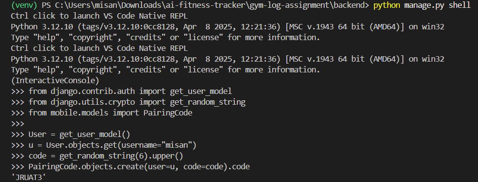
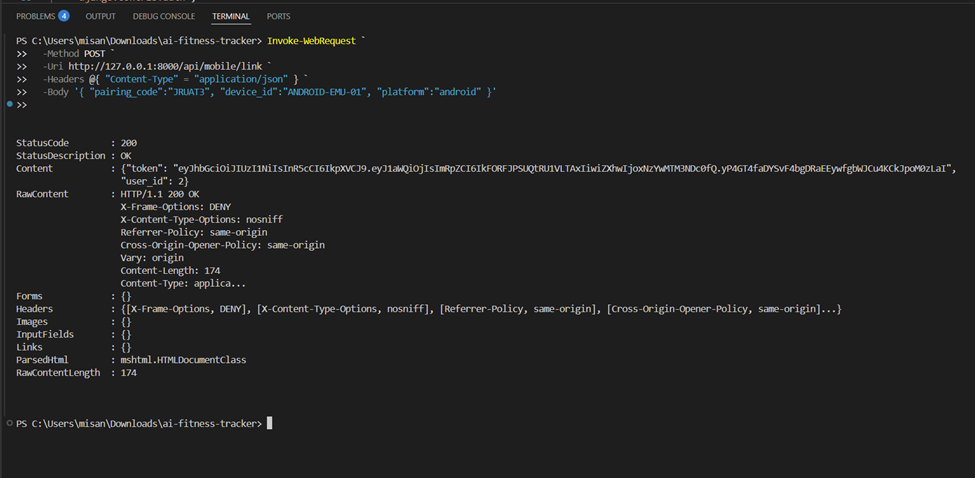
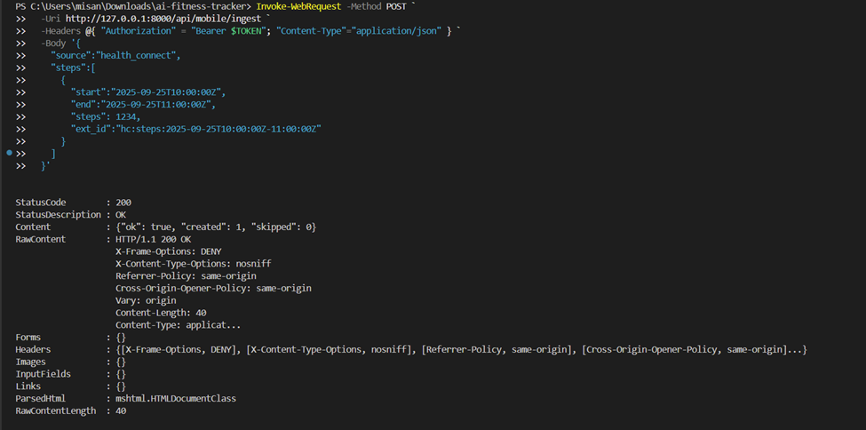
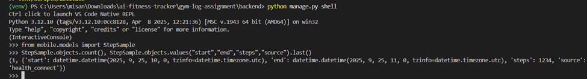

<h1>Documentation of Testing Pairing Code</h1>

<h2> 1) Objective </h2>

    Validate the device pairing flow and data ingest pipeline end-to-end:

    Generate a pairing code for a user.

    Exchange code → JWT via /api/mobile/link.

    Send a sample step payload to /api/mobile/ingest.

    Confirm data persisted in SQLite and server endpoints behave correctly.

<h2>2. Procedure</h2>

<b>a) Generated pairing code with shell</b>

    -got a random code like "Q7Z2KD" (or "JRUAT3" in this instance) stored in PairingCode(user, code, expires_at)

<b>b) Exchange code → JWT (/api/mobile/link)</b>

    -Server validated the pairing code and linked (or updated) a MobileDevice for that user.
    -Issued a JWT (token) containing user id (uid), device id (did), and an expiry.
    -Received { token, user_id }; the device is now authorized for subsequent calls.

<b>c) Ingest sample steps (/api/mobile/ingest)</b>

    -Accepted a batched JSON payload of step data from the device, authenticated via the JWT.
    -Wrote each sample to StepSample using ext_id to avoid duplicates.
    -Updated the device’s last_seen timestamp.
    -Server responded with counts like { created: 1, skipped: 0 }, confirming storage and idempotency.

<b>d) confirmed that the data is stored in database (through Django shell)</b>

    -Queried the database to verify the step row(s) exist with the expected values.
    -saw the saved records (dates, counts, source), proving the pipeline is working.

<h2>3) Results</h2>

    Pass: /api/mobile/link returned a valid JWT for the provided pairing code.

    Pass: /api/mobile/ingest accepted the sample steps event and confirmed created: 1.

    Pass: Data is present in database with correct timestamps, value, and source.
